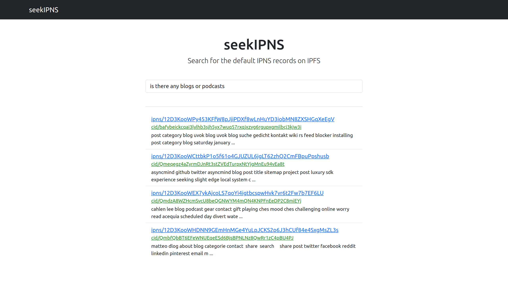
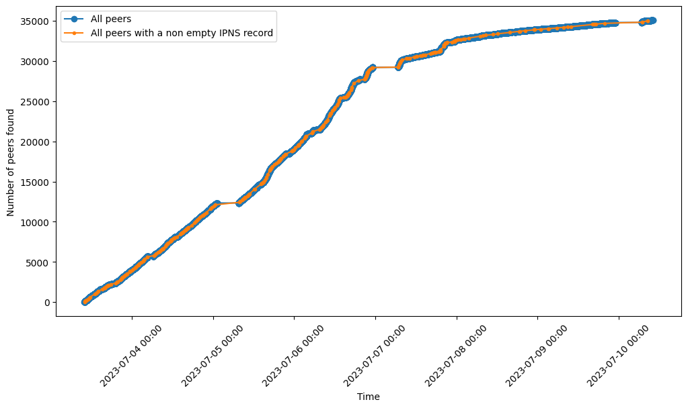
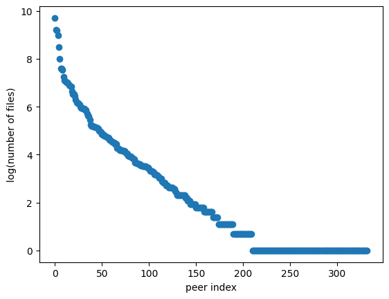
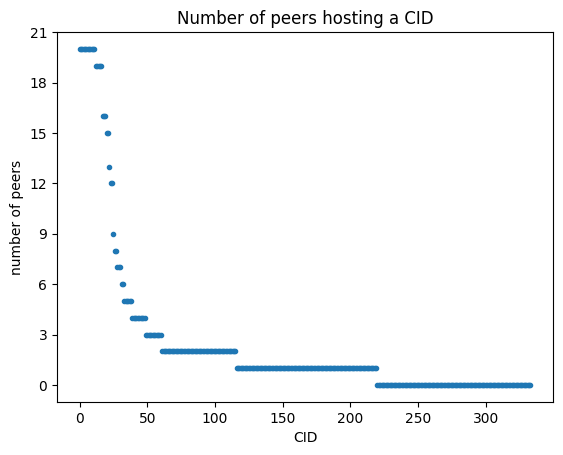

# seekIPNS 
A search engine for IPNS records. 

## Disclaimer
This is a part of my master thesis, so PR will not be accepted since this is for the thesis. 
However feel free to fork and use as you wish. 

## The thesis

The full thesis can be found **[HERE]()**.

### Search

A part of the thesis was building a search engine, which can also be found in this repo, [here](./server/).
The search model used [TF-IDF](https://scikit-learn.org/stable/modules/generated/sklearn.feature_extraction.text.TfidfVectorizer.html).

I made a super simple frontend for it as well which can be found [here](./frontend/).

### Some results

For each IPNS record found 
* Peer ID
* CID
* All file names
* All file path
* All file sizes
* All file formats
* Number of files
* Number of peers hosting the CID
* Time when peer was found

was eveluated 

The records some of the records found on the network was saved and used for search. 

35K unique peers were crawled, and of those, 333 were hosting a nonempty record
in their default IPNS record.

83099 files was found in the crawling.

The decentralization of the content was also looked at: 

